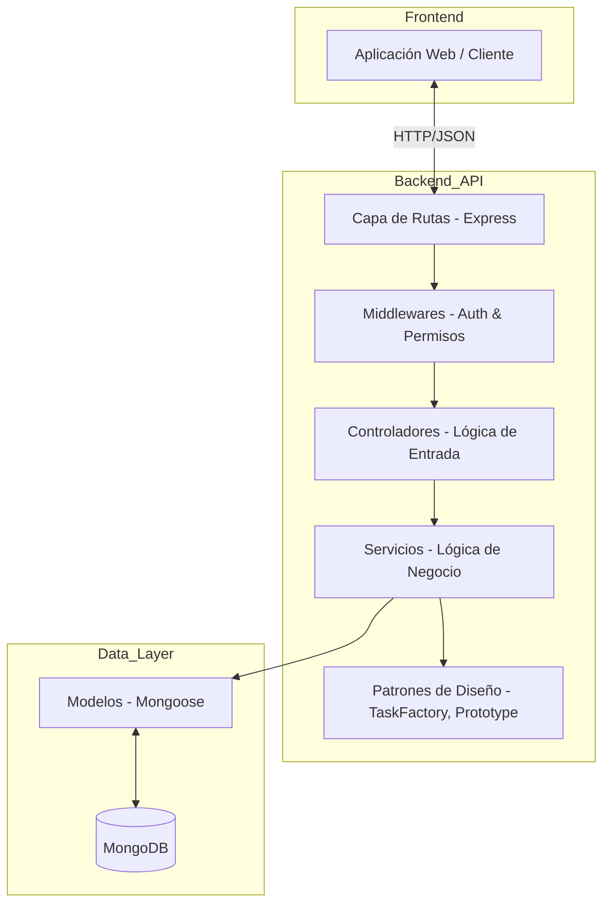
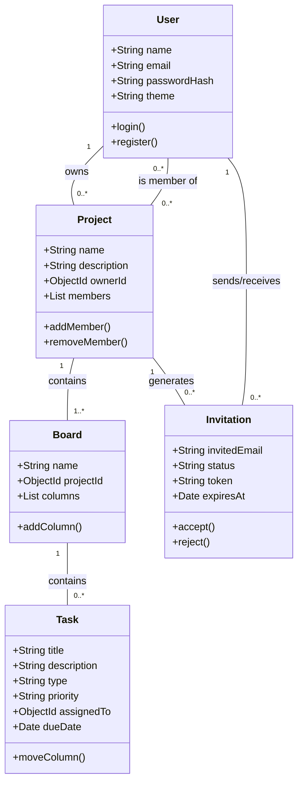

# Documentación del Sistema de Gestión de Proyectos

## 1. Descripción de la Aplicación y Requisitos Funcionales

Esta aplicación es una plataforma de gestión de proyectos tipo Kanban que permite a los equipos organizar tareas, colaborar en tiempo real y gestionar flujos de trabajo de manera eficiente. Los usuarios pueden crear proyectos, invitar a otros colaboradores y organizar el trabajo en tableros con columnas personalizables.

### Requisitos Funcionales
- **Gestión de Usuarios y Autenticación:**
  - Registro e inicio de sesión con JWT.
  - Gestión de perfil de usuario y preferencias de tema (Oscuro/Claro).
- **Gestión de Proyectos:**
  - Creación, edición y eliminación de proyectos.
  - Listado de proyectos donde el usuario es dueño o miembro.
- **Colaboración e Invitaciones:**
  - Invitar a usuarios externos mediante correo electrónico.
  - Aceptar o rechazar invitaciones a proyectos.
  - Control de acceso basado en roles (Admin, Miembro).
- **Tableros y Tareas:**
  - Creación de múltiples tableros por proyecto.
  - Definición de columnas dentro de cada tablero.
  - Creación de tareas con diferentes tipos (Simple, Checklist, Programada).
  - Movimiento de tareas entre columnas.
  - Asignación de tareas, fechas de vencimiento y prioridades.

---

## 2. Diagrama de Casos de Uso

```mermaid
useCaseDiagram
    actor "Usuario Autenticado" as User
    actor "Administrador de Proyecto" as Admin

    package "Gestión de Proyectos" {
        User --> (Listar Proyectos)
        User --> (Ver Tablero)
        User --> (Gestionar Tareas)
        Admin --> (Crear Proyecto)
        Admin --> (Editar Proyecto)
        Admin --> (Invitar Colaboradores)
    }

    package "Sistema" {
        User --> (Login/Registro)
        User --> (Ver Invitaciones)
        User --> (Aceptar/Rechazar Invitación)
    }

    Admin --|> User
```

---

## 3. Diseño Conceptual de Solución (Mockups)

El diseño se basa en una interfaz limpia y moderna con enfoque en la usabilidad.

- **Dashboard Principal:** Una vista de cuadrícula (cards) que muestra todos los proyectos activos del usuario, indicando su rol en cada uno.
- **Vista de Tablero:** Interfaz de columnas (Kanban) donde las tareas se visualizan como tarjetas que pueden arrastrarse entre estados (To Do, In Progress, Done).
- **Detalle de Tarea (Modal):** Ventana emergente que permite editar el título, descripción, asignar responsables, marcar elementos de una checklist y establecer fechas.
- **Panel de Invitaciones:** Sección donde el usuario puede ver las solicitudes pendientes para unirse a nuevos equipos.

---

## 4. Diagrama de Arquitectura (Componentes)

El sistema sigue una arquitectura de capas (Layered Architecture) para asegurar la separación de responsabilidades y la escalabilidad.



---

## 5. Diagrama de Clases UML (Modelo del Dominio)


